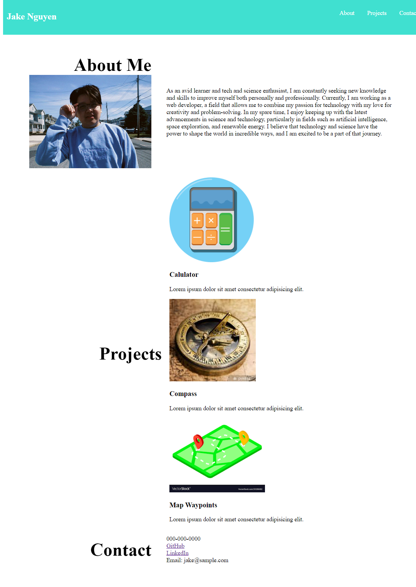

# My Portfolio

This is my personal portfolio website that showcases my work and provides information about my background and skills. The website is built using HTML and CSS and is fully responsive for optimal viewing on all devices. This site will continue to be updated as I build more projects and learn new skills.

## Table of Contents
- [Link](#link)
- [About Me](#about-me)
- [Projects](#projects)
- [Contact Me](#contact-me)

## Link
- Link to the live website:  https://jaketnguyen.github.io/jake-nguyen-html-portfolio/
- Link to the source code on GitHub: https://github.com/JakeTNguyen/jake-nguyen-html-portfolio

## About Me

In the About Me section, you will find information about my background, experience, and interests. I am a web developer with a passion for technology and a drive to constantly learn and improve my skills. I enjoy exploring new technologies and applying them to create innovative solutions.

## Projects

The Projects section showcases some of my recent projects, including web applications and websites that I have built. Each project includes a brief description, a link to the live website, and a link to the source code on GitHub.

## Contact Me

The Contact Me section provides various ways to get in touch with me, including my email address and links to my GitHub and LinkedIn profiles.

## Technologies Used

The website is built using the following technologies:

- HTML
- CSS
